# Manual do Jogo

## Menu
- [Introdução](#introdução)
- [Como Jogar](#como-jogar)
- [Objetivo](#objetivo)
- [Controles](#controles)
- [Personagens](#personagens)
- [Fases](#fases)
- [Pontuação](#pontuação)
- [Dicas](#dicas)
- [Créditos](#créditos)
- [Licença](#licença)
- [Contato](#contato)
- [Versões](#versões)
- [Bugs](#bugs)
- [Contribuidores](#contribuidores-1)
- [Contribuindo](#contribuindo)
- [Imagens](#imagens)
- [Atalhos](#atalhos)

## Introdução

O jogo começa quando um antigo dragão desperta
do seu sono eterno e começa a destruir tudo.

O seu objetivo como herói é derrotar o dragão e salvar o mundo.

Para isso, você deve entrar na torre do dragão e deve derrotar os inimigos que nela abitam, 
e subindo os andares até encontrar o temivel dragão.

## Como Jogar

O jogo é um RPG de turno, no estilo de pokemon.
onde você deve derrotar os inimigos para subir de andar e encontrar o dragão.

Cada personagem, tem 4 movimentos de ataque e 4 movimentos de magia.

Cada movimento tem um limite de uso, chamado PP (Pontos de Poder).

As magias possuem dois tipos, uma sendo de ataque e outra sendo de cura.

Um item secreto pode surgir, podendo ser:
 - Um kit de cura (Cura toda a sua vida)
 - Uma cama de descanso (Recupera os PP's de todos os moves)
 - Um baú de itens (Sorteia um item aleatório)

Apos cada batalha você ira ganhar pontos de experiência, que irão aumentar o seu nível.
Novos moves podem ser adiquiridos dependendo do nivel.

## Objetivo

O seu objetivo principal 
no game é ficar superior 
ao level 50 e derrotar o 
boss dragão, para assim
desbloquear a skin suprema (sun glasses).
 
Para isso você deve 
derrotar os inimigos,
para assim adiquirir 
experiência e subir de 
level, e assim ficar mais 
forte para derrotar o boss.

Além disso, os inimigos dropam 
itens que podem ser usados 
para melhorar o seu personagem ou criar poções.

As Poçoes possuem limite de estoque,
para aumentar o estoque, você precisa melhorar o nivel da mochila.

## Controles

A movimentação do game é bem simples.
Por se tratar de um jogo RPG, você possui os seguintes moves:

- W | Up — Move a seleção para cima
- S | Down — Move a seleção para baixo
- A | Left — Move a seleção para esquerda
- D | Right — Move a seleção para direita
- Enter — escolhe a seleção
- BACKSPACE — função especial
- Esc — Volta para o menu anterior

## Personagens

Os personagens do game são:
- Elfo - nivel: facil
- Mago - nivel: medio
- Guerreiro - nivel: dificil

Cada personagem representa uma dificuldade.
Os inimigos são os mesmos, o que muda é a quantidade
de dano que você causa e vida que possui.

## Fases

As fases são divididas em andares, onde cada andar possui um inimigo diferente.
Em cada andar, pode surgir um item secreto (10% de chance), que pode ser:
 - Um kit de cura (Cura toda a sua vida)
 - Um kit de PP (Recupera o PP's de todos os moves)
 - Um baú de itens (Sorteia um item aleatório)

Ou um inimigo.
Inimigos novos são desbloqueados a cada nivel que passa.
Quanto maior o seu nivel, menor a chance de surgir um inimigo fraco.

Cada inimigo tem uma quantidade de vida e dano diferente, que altera com o nivel do jogador.
Cada inimigo tem a sua taxa de xp fixa, que não altera com o nivel do jogador.

## Pontuação

A pontuação do game é calculada a partir dos seguintes itens:
- XP (Experiência)
- Itens
- Andares que subiu
- Se derrotou o boss
- Nivel da mochila
- Nivel do personagem
- Nivel da arma

O jogo possui duas Classificações de pontuação, 
um para a máquina local, onde grava o historico 
de pontuações, e mostra as 10 melhores.
O outro on-line, onde mostra a pontuação global.

As Classificações são sempre salvas com:
- Nome do jogador
- Pontuação do jogador
- Data do jogo
- Nivel do jogador
- Personagem escolhido

## Dicas

- Use os itens para melhorar o seu personagem
- Use as poções para se curar
- Use os itens para criar poções
- Sempre que possivel melhore sua mochila e espada.
- Use os moves de recuperação de vida com sabedoria.
- Ataques fortes ou especiais, guarde para inimigos importantes.
- Quando estiver proximo de subir de nivel, evite recuperar vida.
- Quando estiver proximo de subir de nivel, evite usar poções exceto as de PP.

## Créditos

- [Oracle JAVA](https://www.oracle.com/technetwork/java/javase/downloads/index.html "Oracle JAVA")
- [Sprites](https://www.spriters-resource.com/mobile/finalfantasyrecordkeeper/ "Sprites")
- Fundos do jogo — Pegos de fanart dos games:
    - Final Fantasy
    - Dragon Quest
    - Chrono Trigger
    - Kingdom Hearts
- [GitHub](https://github.com "GitHub")
- [IntelliJ IDEA](https://www.jetbrains.com/idea/ "IntelliJ IDEA")

### Desenvolvedores
- [luix-guxto](https://github.com/luix-guxto "luix-guxto")

### Contribuidores
- [luix-guxto](https://github.com/luix-guxto "luix-guxto - DEV")
- Doadores:
    - Ninguem :(

## Licença

[MIT](https://choosealicense.com/licenses/mit/ "MIT")

Licença MIT, para mais informações, leia o arquivo LICENSE.

## Contato

- [E-mail](mailto:luisaugustoway@gmail.com "E-mail")
- [GitHub](https://github.com/luix-guxto "luix-guxto")
- [WhatsApp](https://wa.me/5531999949012 "WhatsApp")

## Versões

- 1.0.0
    - Versão inicial
    - Adicionado o jogo
    - Adicionado o README
    - Adicionado o LICENSE
    - Adicionado o .gitignore

## Bugs

Para reportar falhas ou erros, favor utilizar o campo de issues do GitHub.

[Issues](https://github.com/luix-guxto/Text-Rpg/issues "Issues")

## Contribuidores

### Lista de contribuidores:
- Ninguem :(

## Contribuindo

Para Contribuir, tem duas formas:
- Doando:
    - pix: chave E-mail: luisaugustoway@gmail.com
- Por código:
    - Faça um fork do projeto
    - Crie uma branch para sua modificação (`git checkout -b feature/fooBar`)
    - Faça o commit (`git commit -am 'Add some fooBar'`)
    - Faça o push (`git push origin feature/fooBar`)
    - Crie um novo Pull Request

## Imagens

###### Licença MIT
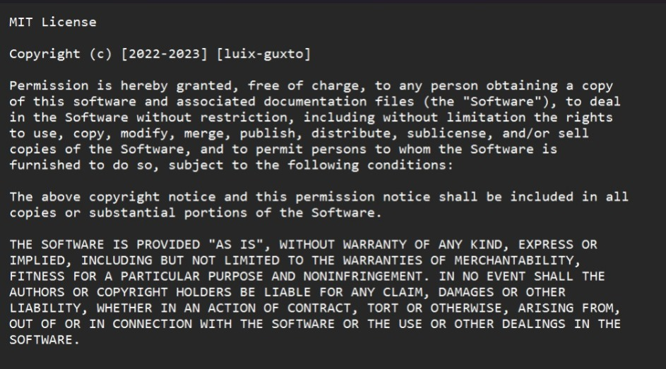

###### Tela de carregamento
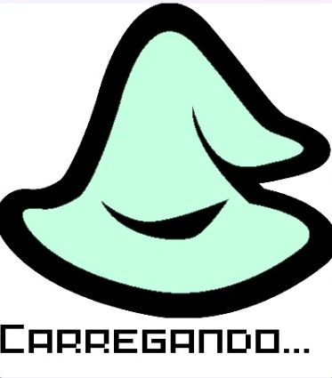

###### Tela inicial
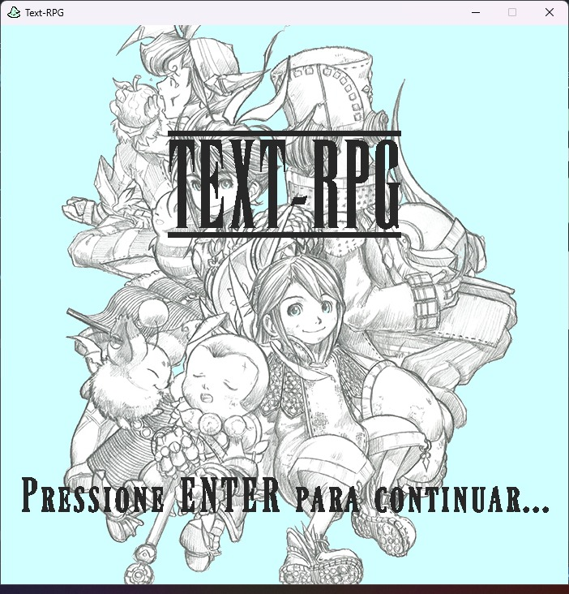

###### Tela de menu
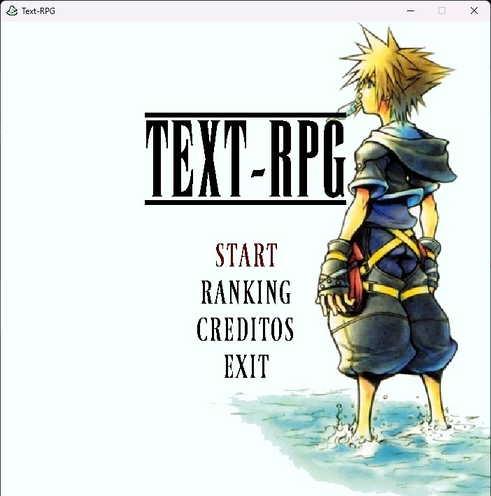

###### Tela de ranking
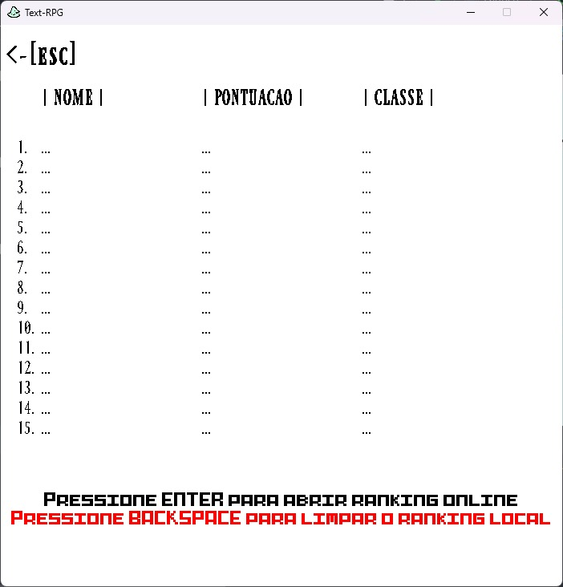

###### Tela de creditos
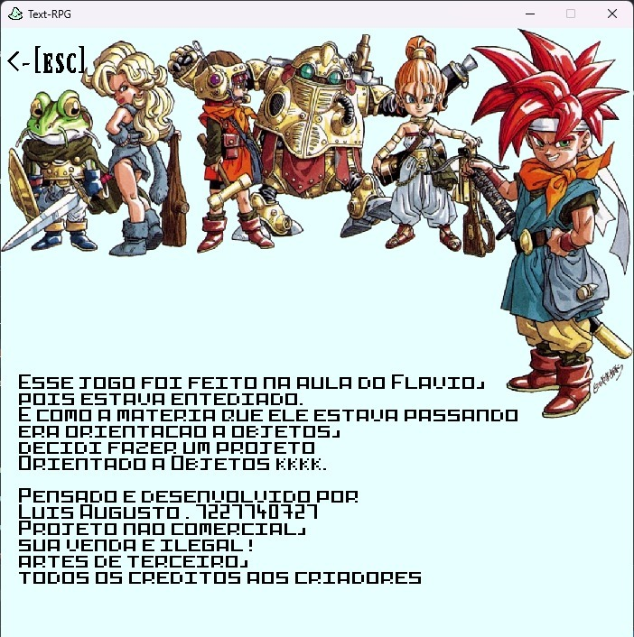

###### Tela de seleção de saves
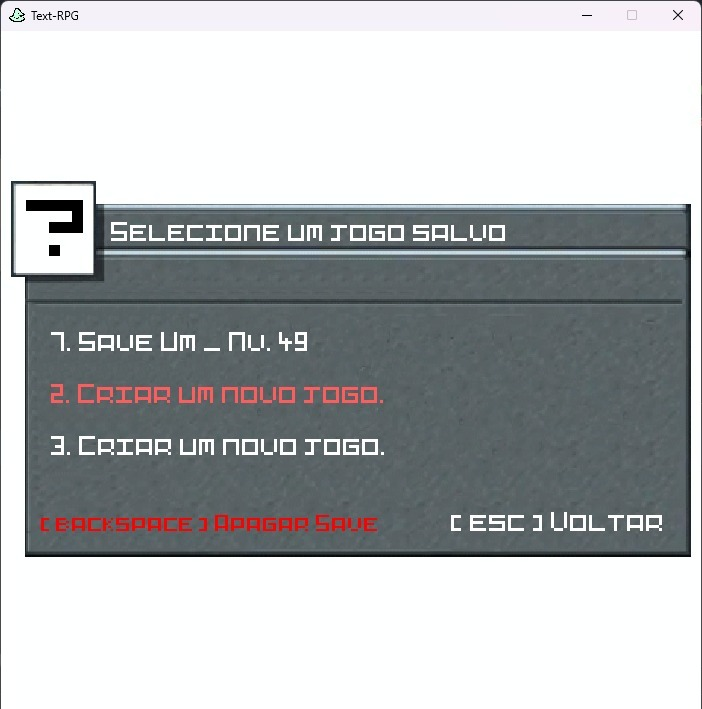

###### Criando um novo save

- Digite o nome do save

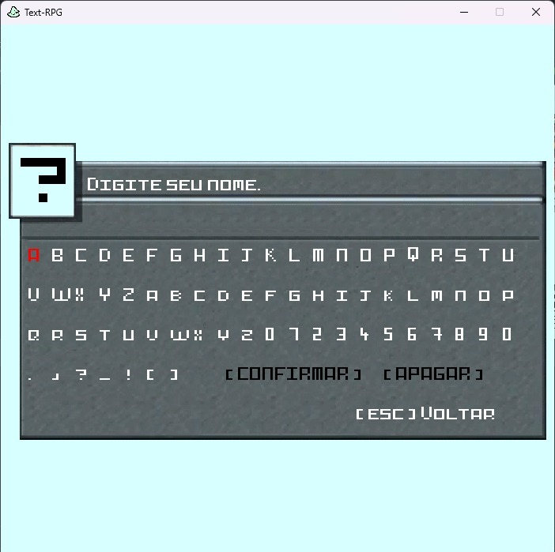

- Selecione o personagem

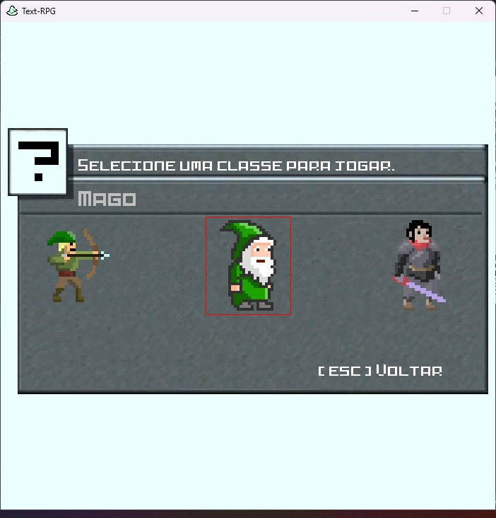

###### História
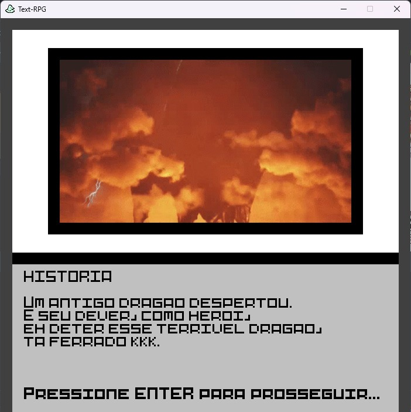

###### Tela de batalha

- Pre batalha

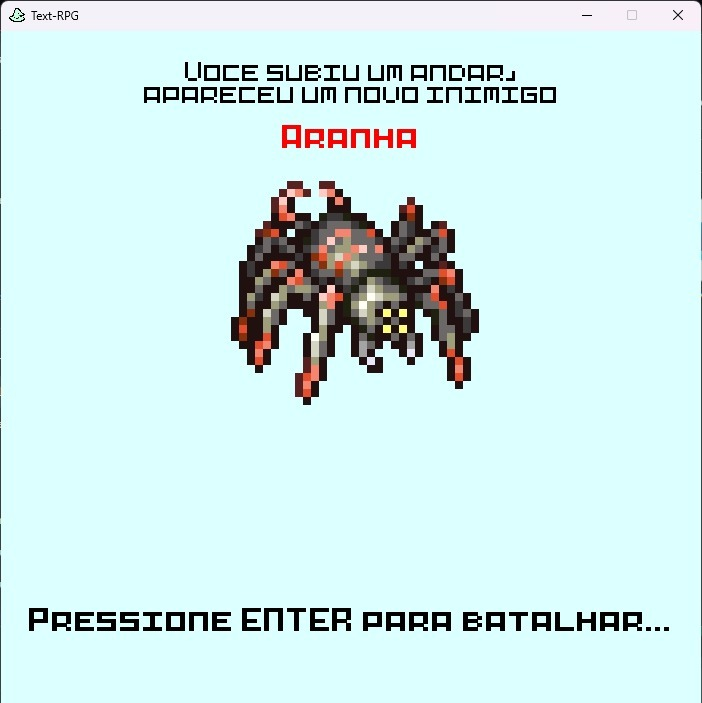

- Batalha

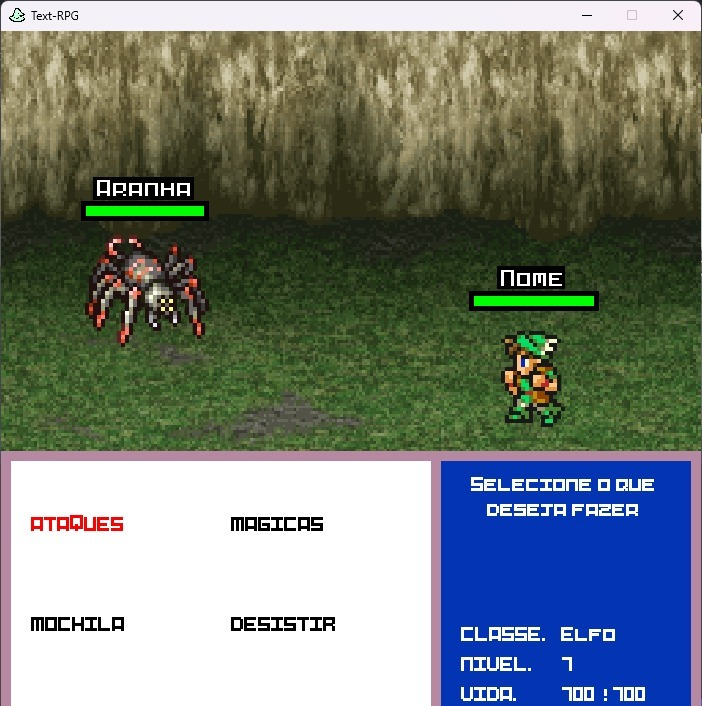

- PAUSE

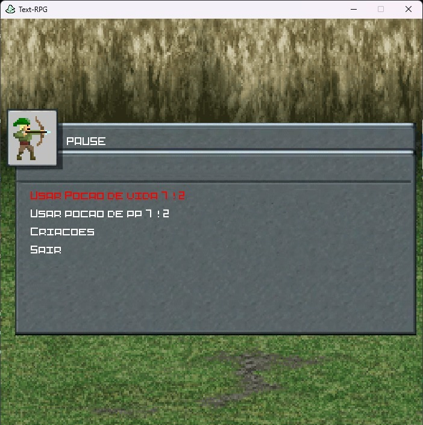

- Pos batalha

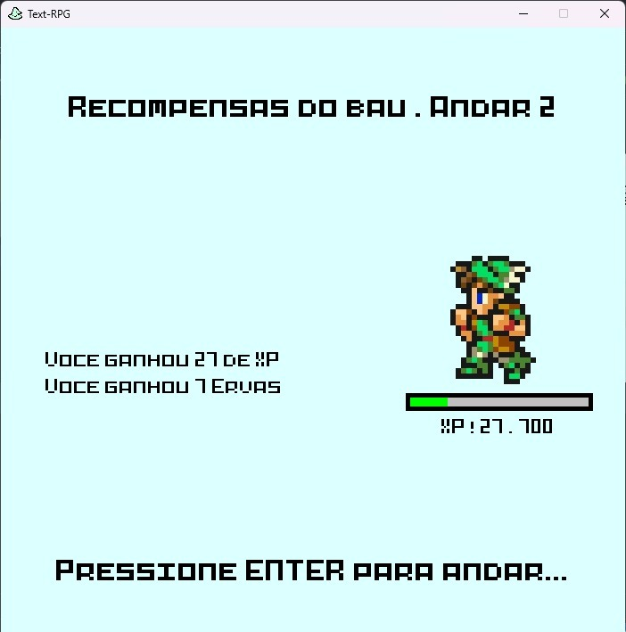

- BAU

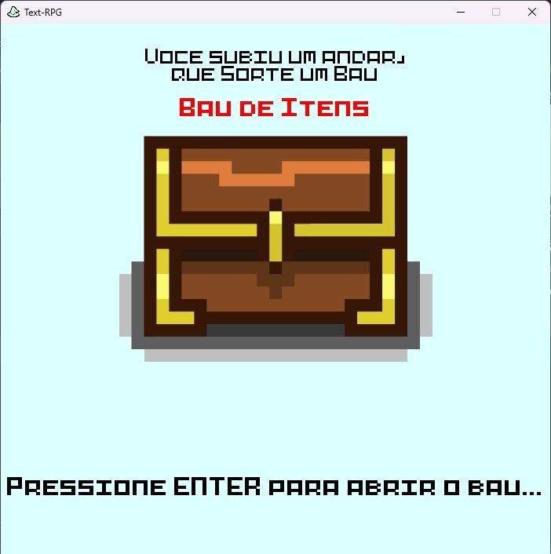

- GAME OVER

## Atalhos
- [Menu](#menu "Menu")
- [Projeto](https://github.com/luix-guxto/text-rpg/ "Projeto")
- [README](https://github.com/luix-guxto/text-rpg/#readme "README")